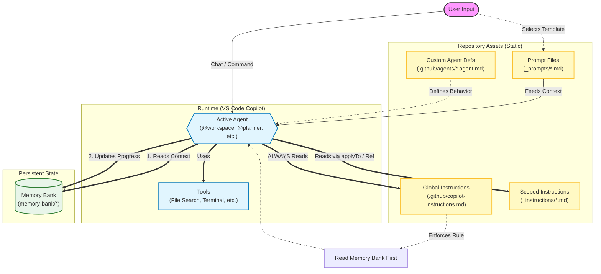

# LLM Information Flow Architecture

This document explains how information flows and is shared between Prompts, Instructions, Agents, and the Memory Bank within this repository's AI-assisted workflow.

## Architecture Overview

The workflow is designed to provide **deterministic**, **context-aware**, and **tool-enabled** assistance by layering static rules (Instructions) over dynamic interactions (Agents) and persistent state (Memory Bank).

## Component Roles

### 1. User Input & Prompts

- **User Input**: The starting point. Can be a free-form chat message or a command.
- **Prompts (`_prompts/`)**: Reusable templates for specific tasks (e.g., "Refactor Code", "Write Documentation"). They provide a structured starting point for the Agent but are meant for *initiation*.

### 2. Agents (The Runtime Controller)

- **Agents**: The active persona (e.g., `@workspace`, `@planner`, or custom agents defined in `.github/agents/`).
- **Role**: They orchestrate the execution. They decide which tools to use and which instructions to apply.
- **Definition**: Custom agents (`.agent.md`) define specific allowed tools and system prompts (personas).

### 3. Instructions (The Rules)

- **Global Instructions (`.github/copilot-instructions.md`)**: The "Constitution" of the repo. Always active. It enforces high-level rules like "Read the Memory Bank first" and "Use Conventional Commits".
- **Scoped Instructions (`_instructions/`)**: Specialized rules applied based on context.
  - **`applyTo`**: Automatically loaded when working on matching files (e.g., `*.py` loads Python rules).
  - **Reference**: Can be explicitly referenced by Agents or Prompts to pull in specific knowledge (e.g., "Use `code-review.instructions.md`").

### 4. Memory Bank (The Persistent Context)

- **Role**: Acts as the long-term memory for the AI, persisting context across sessions.
- **Flow**:
  1. **Read**: At the start of a task, the Agent reads `projectbrief.md`, `activeContext.md`, etc., to understand the current state.
  2. **Act**: The Agent performs work using Tools.
  3. **Write**: The Agent updates `progress.md` and `activeContext.md` to record decisions and outcomes.

### 5. Tools

- **Role**: Capabilities provided to the Agent (e.g., `read_file`, `run_terminal`, `file_search`).
- **Control**: Custom agents can restrict which tools are available (e.g., a "Planner" agent might only have read-only tools).
