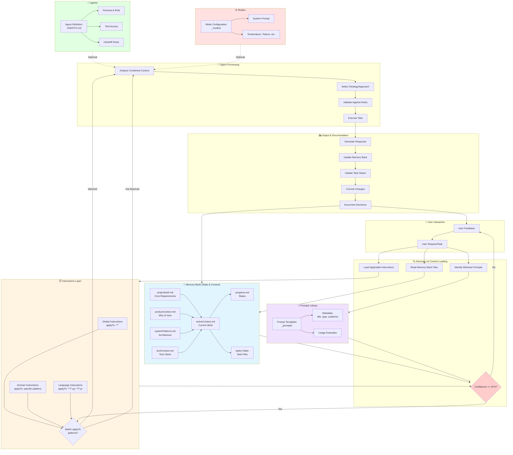
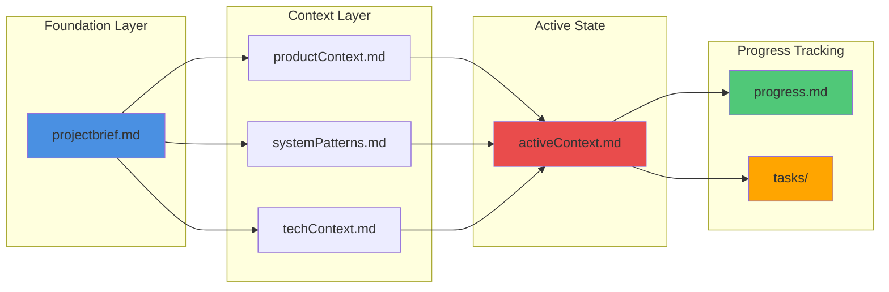
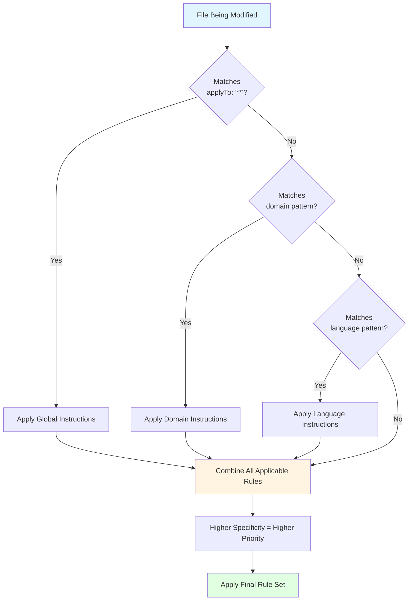
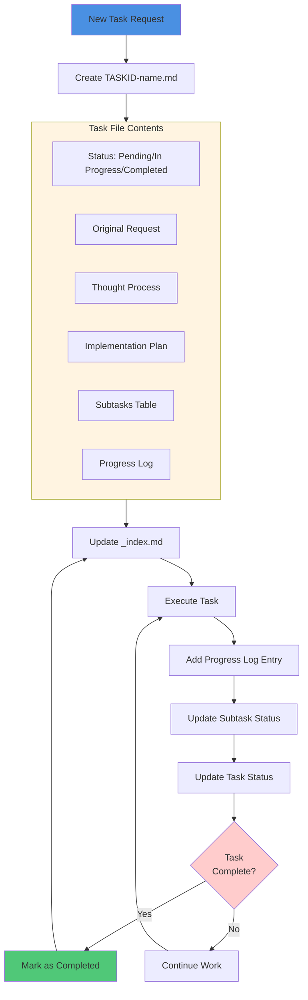
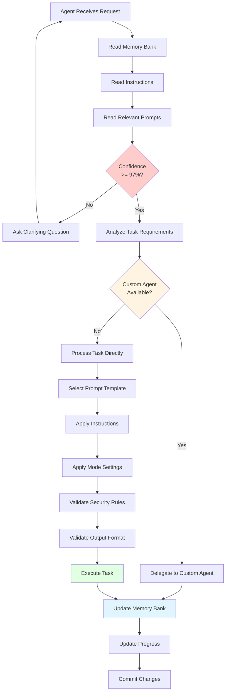
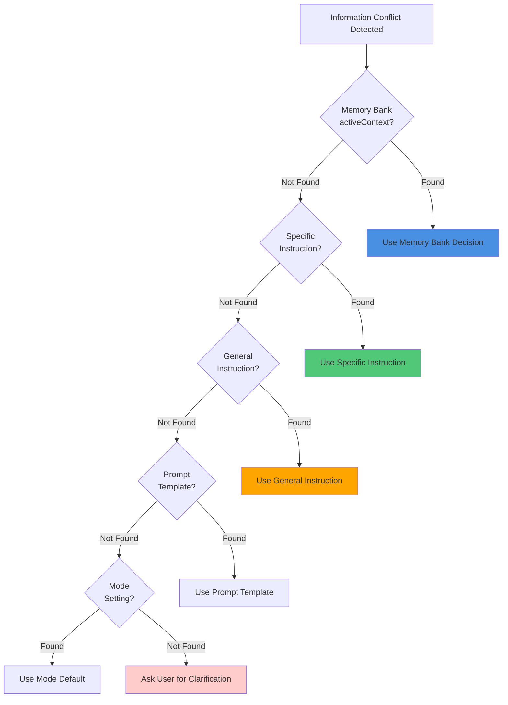

# LLM Information Flow and Architecture

This document provides a comprehensive visual guide to understanding how information flows between different LLM-related components in the ai-tools repository: prompts, instructions, agents, modes, and the Memory Bank.

## Overview

The ai-tools repository uses a layered architecture where different types of files serve specific purposes in guiding AI behavior:

- **Prompts** (`_prompts/`): Reusable interaction templates for specific tasks
- **Instructions** (`_instructions/`): Machine-oriented guidance with scoping rules
- **Agents** (`_agents/`): Interactive personas with specific tool access
- **Modes** (`_modes/`): Interaction configurations and system prompts
- **Memory Bank** (`memory-bank/`): Persistent project context and state

## Complete Information Flow Architecture

## Detailed Component Breakdown

### 1. Memory Bank Architecture

The Memory Bank maintains project state across sessions:

### 2. Instruction File Scoping

How agents select applicable instructions:

### 3. Task Management Workflow

How tasks are created, tracked, and completed:

### 4. Agent Decision-Making Process

How agents process requests and decide actions:

### 5. Information Priority Hierarchy

When conflicts arise, information sources have this priority:

## Key Principles

### 1. **Memory Bank is Source of Truth**
The Memory Bank files (`memory-bank/`) contain the canonical project state and should be consulted at the start of every session.

### 2. **Instructions Use applyTo Scoping**
Instruction files include `applyTo` patterns (glob syntax) to define which files they apply to:
- `applyTo: '**'` - applies globally
- `applyTo: '**/*.py'` - applies to Python files
- `applyTo: 'scripts/*.py'` - applies only to Python files in scripts/

### 3. **Confidence Gate Enforcement**
Agents must express confidence percentage and ask clarifying questions if confidence < 97% before proceeding.

### 4. **Layered Guidance System**
- **Global Instructions**: Apply everywhere (security, memory bank, git)
- **Domain Instructions**: Apply to specific areas (python/, kubernetes/)
- **Language Instructions**: Apply to file types (\*.py, \*.js)

### 5. **Task-Driven Documentation**
Non-trivial work should be documented in `memory-bank/tasks/` with:
- Task ID and name
- Original request
- Thought process
- Implementation plan
- Progress tracking
- Progress log

## Usage Patterns

### When to Use Each Component

| Component | Use When | Example |
|-----------|----------|---------|
| **Prompt** | Quick prototyping, ad-hoc generation, interactive refinement | Code review template, documentation writer |
| **Instruction** | Consistent automated behavior, CI/CD rules, contributor guidance | Python coding standards, security checklist |
| **Agent** | Interactive persona with specific tools, complex workflows | Custom code reviewer, specialized analyzer |
| **Mode** | Setting interaction context, system behavior configuration | Advanced coding assistant, research mode |
| **Memory Bank** | Maintaining project state, tracking decisions, documenting context | Current focus, completed work, task history |

## Best Practices

### For Contributors

1. **Read Memory Bank First**: Always start by reading `projectbrief.md`, `activeContext.md`, and `progress.md`
2. **Follow applyTo Patterns**: When creating instructions, use specific patterns to avoid conflicts
3. **Update Documentation**: Document decisions and changes in Memory Bank files
4. **Use Conventional Commits**: Follow the commit message format specified in instructions
5. **No Hardcoded Secrets**: Use environment variables for all sensitive data

### For Agents

1. **Express Confidence**: Always state confidence percentage in responses
2. **Ask When Uncertain**: If confidence < 97%, ask clarifying questions
3. **Combine Context**: Use Memory Bank + Instructions + Prompts together
4. **Delegate When Possible**: Use custom agents for specialized tasks
5. **Document Changes**: Update Memory Bank files after significant changes

## Examples

### Example 1: Adding a New Python Script

**Information Flow:**
1. Agent reads Memory Bank → understands project structure
2. Agent loads `python.instructions.md` (matches `applyTo: '**/*.py'`)
3. Agent loads `security-and-owasp.instructions.md` (global security rules)
4. Agent checks confidence → 98% confident, proceeds
5. Agent creates script following Python conventions
6. Agent updates `activeContext.md` with decision
7. Agent commits with conventional commit message

### Example 2: Reviewing Code

**Information Flow:**
1. Agent reads task from `memory-bank/tasks/`
2. Agent loads relevant prompt: `code-review-assistant.md`
3. Agent loads instructions for file types being reviewed
4. Agent applies mode settings: `advanced-coding-assistant.md`
5. Agent performs review following combined guidance
6. Agent updates task progress log
7. Agent updates `progress.md` with review completion

## Related Documentation

- [Design and Memory Bank](./design-and-memory-bank.md) - Overview of Memory Bank concept
- [Add a Prompt or Instruction](../how-to/add-a-prompt-or-instruction.md) - How-to guide for adding new content
- [Prompt Engineering Best Practices](../guides/prompt-engineering-best-practices.md) - Best practices for prompts
- [Authoring Guidelines](../../memory-bank/authoring-guidelines.md) - Comprehensive authoring standards

## Maintenance

This document should be updated when:
- New component types are added to the repository
- Information flow patterns change significantly
- New best practices are established
- User feedback indicates confusion about information sharing

---

**Last Updated**: 2025-11-20  
**Status**: Active Documentation
