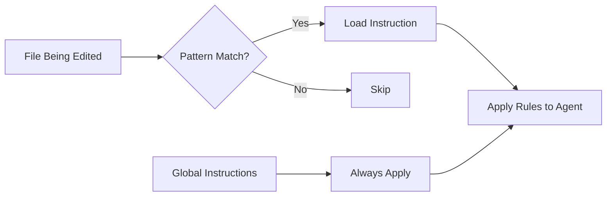
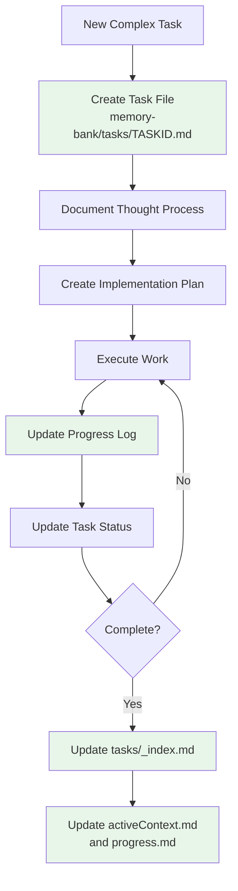
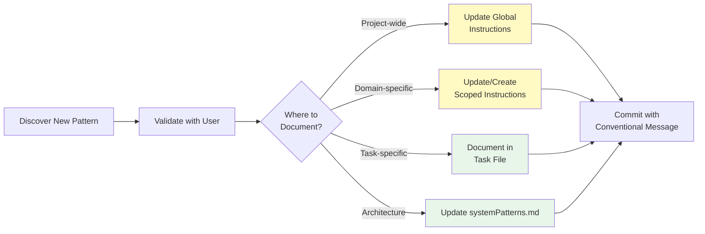

# Information Sharing Workflow
{: .no_toc }

This guide explains the complete workflow for how information should be shared between different components in the AI Tools repository: Prompts, Instructions, Agents, Modes, and the Memory Bank.
{: .fs-6 .fw-300 }

---

## Table of Contents
{: .no_toc .text-delta }

1. TOC
{:toc}

---

## Complete Information Flow Diagram

The following diagram illustrates the complete lifecycle of how information flows through the system, from initial user request to task completion and knowledge persistence.

```mermaid
flowchart TD
    Start([User Request]) --> ReadMB[Read Memory Bank]
    
    ReadMB --> CheckMB{Memory Bank<br/>Complete?}
    CheckMB -->|No| CreateMB[Create/Update<br/>Memory Bank Files]
    CreateMB --> ReadMB
    CheckMB -->|Yes| LoadContext[Load Project Context]
    
    LoadContext --> ParseRequest[Parse User Request]
    
    ParseRequest --> SelectType{Request Type?}
    
    %% Prompt Path
    SelectType -->|Use Template| SelectPrompt[Select Prompt<br/>from _prompts/]
    SelectPrompt --> LoadPrompt[Load Prompt Content]
    LoadPrompt --> ApplyPrompt[Apply Prompt Template]
    ApplyPrompt --> IdentifyInst
    
    %% Mode Path
    SelectType -->|Configure Mode| SelectMode[Select Mode<br/>from _modes/]
    SelectMode --> LoadMode[Load Mode Config]
    LoadMode --> ApplyMode[Apply System Settings]
    ApplyMode --> IdentifyInst
    
    %% Direct Path
    SelectType -->|Direct Task| IdentifyInst[Identify Applicable<br/>Instructions]
    
    %% Instructions Identification
    IdentifyInst --> LoadGlobal[Load Global Instructions<br/>.github/copilot-instructions.md]
    LoadGlobal --> CheckScope{File Context<br/>Available?}
    
    CheckScope -->|Yes| ApplyScope[Apply Scoped Instructions<br/>via applyTo patterns]
    CheckScope -->|No| CheckRef{Referenced<br/>Instructions?}
    ApplyScope --> CheckRef
    
    CheckRef -->|Yes| LoadRef[Load Referenced<br/>_instructions/*.md]
    CheckRef -->|No| SelectAgent
    LoadRef --> SelectAgent
    
    %% Agent Selection
    SelectAgent{Select Agent} --> DefaultAgent[@workspace<br/>Default Agent]
    SelectAgent --> CustomAgent[Custom Agent<br/>from _agents/]
    
    DefaultAgent --> AgentExec[Agent Execution Context]
    CustomAgent --> AgentExec
    
    %% Execution Phase
    AgentExec --> ConfidenceCheck{Confidence<br/>>= 97%?}
    ConfidenceCheck -->|No| AskClarify[Ask Clarifying Questions]
    AskClarify --> UserResponse[User Responds]
    UserResponse --> ConfidenceCheck
    
    ConfidenceCheck -->|Yes| PlanTask[Plan Task Execution]
    PlanTask --> CreateTaskFile{Complex Task?}
    
    CreateTaskFile -->|Yes| NewTask[Create Task File<br/>memory-bank/tasks/TASKID.md]
    CreateTaskFile -->|No| ExecuteTask
    NewTask --> UpdateIndex[Update tasks/_index.md]
    UpdateIndex --> ExecuteTask
    
    %% Task Execution
    ExecuteTask[Execute Task with Tools] --> ToolUse{Tools Needed?}
    
    ToolUse -->|File Operations| FileTools[Use File Tools]
    ToolUse -->|Terminal| TerminalTools[Use Terminal]
    ToolUse -->|Search| SearchTools[Use Search]
    ToolUse -->|None| CompleteWork
    
    FileTools --> CompleteWork[Complete Work]
    TerminalTools --> CompleteWork
    SearchTools --> CompleteWork
    
    %% Validation
    CompleteWork --> ValidateWork{Validation<br/>Needed?}
    ValidateWork -->|Yes| RunTests[Run Tests/Linters]
    RunTests --> TestPass{Tests Pass?}
    TestPass -->|No| FixIssues[Fix Issues]
    FixIssues --> RunTests
    TestPass -->|Yes| DocumentWork
    ValidateWork -->|No| DocumentWork
    
    %% Documentation Phase
    DocumentWork[Document Changes] --> UpdateMBContext[Update activeContext.md]
    UpdateMBContext --> UpdateMBProgress[Update progress.md]
    UpdateMBProgress --> UpdateTask{Task File<br/>Exists?}
    
    UpdateTask -->|Yes| UpdateTaskFile[Update Task Progress Log]
    UpdateTask -->|No| CheckNewInst
    UpdateTaskFile --> CheckNewInst
    
    CheckNewInst{New Patterns<br/>Learned?} -->|Yes| UpdateInst[Document in<br/>_instructions/]
    CheckNewInst -->|No| CommitMsg
    UpdateInst --> CommitMsg
    
    %% Completion
    CommitMsg[Generate Conventional<br/>Commit Message] --> End([Task Complete])
    
    %% Styling
    classDef memoryNode fill:#e8f5e9,stroke:#2e7d32,stroke-width:3px
    classDef componentNode fill:#fff9c4,stroke:#fbc02d,stroke-width:2px
    classDef agentNode fill:#e1f5fe,stroke:#0277bd,stroke-width:2px
    classDef executionNode fill:#f3e5f5,stroke:#6a1b9a,stroke-width:2px
    classDef decisionNode fill:#ffe0b2,stroke:#e65100,stroke-width:2px
    
    class ReadMB,LoadContext,UpdateMBContext,UpdateMBProgress,CreateMB memoryNode
    class SelectPrompt,LoadPrompt,SelectMode,LoadMode,LoadGlobal,ApplyScope,LoadRef componentNode
    class SelectAgent,DefaultAgent,CustomAgent,AgentExec agentNode
    class ExecuteTask,ToolUse,FileTools,TerminalTools,SearchTools,CompleteWork,RunTests executionNode
    class CheckMB,SelectType,CheckScope,CheckRef,ConfidenceCheck,CreateTaskFile,ValidateWork,TestPass,UpdateTask,CheckNewInst decisionNode
```

---

## Component Roles and Responsibilities

### 1. Memory Bank (Persistent Context)

**Purpose**: Maintains project state and context across AI sessions.

**Key Files**:
- `projectbrief.md` - Project scope and objectives
- `activeContext.md` - Current work focus and recent changes
- `progress.md` - What works and what's pending
- `systemPatterns.md` - Architecture and design decisions
- `techContext.md` - Technologies and setup
- `tasks/` - Individual task tracking with thought processes

**Information Flow**:
- **IN**: Updates from every significant work session
- **OUT**: Context loaded at session start
- **Sharing**: Read first, write last

**Best Practices**:
```markdown
1. ALWAYS read Memory Bank files at session start
2. Update activeContext.md when focus shifts
3. Update progress.md after completing milestones
4. Create task files for complex, multi-step work
5. Document new patterns in systemPatterns.md
```

---

### 2. Prompts (Templates and Starting Points)

**Purpose**: Provide reusable templates for common tasks.

**Location**: `_prompts/` directory

**Structure**:
```yaml
---
title: "Descriptive Prompt Title"
category: "coding|writing|analysis|creative|productivity"
description: "What this prompt does"
tags: ["tag1", "tag2"]
use_case: "When to use this"
---

# Prompt content with placeholders
```

**Information Flow**:
- **IN**: User selection or recommendation
- **OUT**: Structured request to Agent
- **Cross-Reference**: Can reference Instructions for detailed guidance

**Sharing Pattern**:
```markdown
Prompt → Agent → Instructions (referenced) → Execution
```

**Best Practices**:
1. Keep prompts focused on a single task type
2. Include clear usage examples
3. Reference related instructions with links
4. Tag appropriately for discoverability
5. Document expected inputs and outputs

---

### 3. Instructions (Scoped Rules and Guidelines)

**Purpose**: Define rules, conventions, and best practices that apply to specific contexts.

**Types**:

#### Global Instructions
- **File**: `.github/copilot-instructions.md`
- **Scope**: `applyTo: "**"` (always active)
- **Content**: Core rules, Memory Bank workflow, commit conventions

#### Scoped Instructions
- **Location**: `_instructions/*.instructions.md`
- **Scope**: `applyTo: "pattern"` (applied based on file context)
- **Examples**:
  - `python.instructions.md` with `applyTo: "**/*.py"`
  - `markdown.instructions.md` with `applyTo: "**/*.md"`

**Information Flow**:


**Sharing Pattern**:
- **Automatic**: Via `applyTo` patterns
- **Explicit**: Via direct reference in prompts or modes
- **Layered**: Global always applies, scoped adds specifics

**Best Practices**:
1. Use specific `applyTo` patterns to avoid over-application
2. Keep instructions focused on their domain
3. Reference other instructions when building on concepts
4. Document the `applyTo` pattern clearly in front matter
5. Avoid conflicting rules across instruction files

---

### 4. Modes (Configuration Presets)

**Purpose**: Pre-configured AI interaction settings for specific workflows.

**Location**: `_modes/` directory

**Structure**:
```yaml
---
title: "Mode Name"
mode_type: "development|research|documentation|troubleshooting"
ai_model: "Recommended model"
context_length: "Token limit guidance"
best_for: "Use case description"
instructions:
  - "instruction-file-1.md"
  - "instruction-file-2.md"
---

# Configuration details and usage
```

**Information Flow**:
- **IN**: User selects mode for session
- **OUT**: System configuration + referenced instructions
- **Cross-Reference**: Links to multiple instructions

**Sharing Pattern**:
```markdown
Mode Selection → Load Config → Load Referenced Instructions → Agent Context
```

**Best Practices**:
1. Group related instructions in a mode
2. Document when to use each mode
3. Specify optimal model settings
4. Include example workflows
5. Keep modes task-focused, not tool-focused

---

### 5. Agents (Execution Context)

**Purpose**: Active persona that orchestrates task execution.

**Types**:
- **Default**: `@workspace` - General-purpose agent
- **Built-in**: `@terminal`, `@vscode` - Specialized contexts
- **Custom**: Defined in `_agents/*.agent.md`

**Custom Agent Structure**:
```yaml
---
name: "agent-name"
description: "What this agent does"
allowed_tools:
  - tool1
  - tool2
system_prompt: |
  Detailed persona and behavior instructions
---

# Additional configuration
```

**Information Flow**:
- **IN**: User request + Instructions + Memory Bank context
- **OUT**: Tool usage + updated artifacts + Memory Bank updates
- **Decision Making**: Selects tools, applies instructions, validates confidence

**Sharing Pattern**:
```markdown
Agent Receives:
  ├─ Memory Bank Context (session state)
  ├─ Global Instructions (always)
  ├─ Scoped Instructions (via applyTo)
  ├─ Mode Configuration (if selected)
  └─ Prompt Template (if used)

Agent Produces:
  ├─ Executed Actions (via tools)
  ├─ Updated Files
  ├─ Memory Bank Updates
  └─ Task Documentation
```

**Best Practices**:
1. Always read Memory Bank first (enforced by global instructions)
2. Check confidence before acting (>= 97% threshold)
3. Document decisions in task files for complex work
4. Use appropriate tools for the task
5. Update Memory Bank after significant changes

---

## Information Sharing Patterns

### Pattern 1: Sequential Layering

**Use Case**: Building context from general to specific


**Example**: Python code review
1. Global: Conventional commits, Memory Bank workflow
2. Scoped: Python style guide, testing requirements
3. Mode: Code review checklist
4. Prompt: Specific review focus areas
5. Agent: Executes review with accumulated context

---

### Pattern 2: Cross-Referencing

**Use Case**: Linking related components

**In Prompts**:
```markdown
For detailed coding standards, see:
- [Python Instructions](_instructions/python.instructions.md)
- [Code Review Guide](_instructions/code-review.instructions.md)
```

**In Instructions**:
```markdown
This instruction extends:
- [General Instructions](_instructions/general.instructions.md)

See also:
- [Security Guidelines](_instructions/security-and-owasp.instructions.md)
```

**In Modes**:
```yaml
instructions:
  - python.instructions.md
  - pytest.instructions.md
  - code-review.instructions.md
```

---

### Pattern 3: Task-Based Workflow

**Use Case**: Managing complex, multi-session work



**Task File Structure**:
```markdown
# [TASK001] - Feature Name

**Status:** In Progress
**Added:** 2025-01-15
**Updated:** 2025-01-20

## Original Request
User's original description...

## Thought Process
Discussion and reasoning...

## Implementation Plan
- [ ] Step 1
- [ ] Step 2
- [x] Step 3 (completed)

## Progress Log
### 2025-01-20
- Completed step 3
- Started step 4
- Decision: chose approach X because...
```

---

### Pattern 4: Knowledge Capture

**Use Case**: Learning and evolving the system



---

## Best Practices Summary

### For All Components

1. **Discoverability**: Use clear titles, descriptions, and tags
2. **Cross-Reference**: Link related components explicitly
3. **Single Responsibility**: Each component serves one clear purpose
4. **Documentation**: Include usage examples and context
5. **Versioning**: Track changes with conventional commits

### For Information Sharing

1. **Read Memory Bank First**: Always load context at session start
2. **Layer Context**: Build from general (global) to specific (scoped)
3. **Document Decisions**: Capture rationale in task files
4. **Update Progressively**: Keep Memory Bank current throughout work
5. **Reference, Don't Duplicate**: Link to instructions rather than copying content

### For Maintainability

1. **Consistent Structure**: Follow established front matter patterns
2. **Clear Scope**: Use `applyTo` patterns precisely
3. **Avoid Conflicts**: Ensure instructions don't contradict
4. **Test Coverage**: Validate changes don't break workflows
5. **Knowledge Transfer**: Update instructions when patterns emerge

---

## Troubleshooting

### Issue: Agent Not Applying Instructions

**Check**:
1. Is the `applyTo` pattern matching the file context?
2. Are there conflicting instructions with different rules?
3. Is the instruction file in the correct location?

**Solution**:
```markdown
1. Review the applyTo pattern in front matter
2. Test with a specific file context
3. Check for overlapping scopes in other instructions
```

---

### Issue: Memory Bank Not Being Read

**Check**:
1. Does `memory-bank/` directory exist?
2. Are core files (projectbrief.md, activeContext.md) present?
3. Is the global instruction enforcing Memory Bank workflow?

**Solution**:
```markdown
1. Ensure global instructions reference Memory Bank workflow
2. Create missing core Memory Bank files
3. Explicitly request "Read Memory Bank" at session start
```

---

### Issue: Circular References Between Components

**Check**:
1. Are components referencing each other in a loop?
2. Is there a clear hierarchy of dependencies?

**Solution**:
```markdown
1. Establish clear hierarchy: Global → Scoped → Mode → Prompt
2. References should flow "up" the hierarchy (specific to general)
3. Use abstractions to break circular dependencies
```

---

## Practical Examples

### Example 1: Code Review Workflow

**User Request**: "Review the Python script for security issues"

**Information Flow**:
```
1. Read Memory Bank → Load project context
2. File context: *.py → Apply python.instructions.md
3. Global instructions → Apply security-and-owasp.instructions.md
4. Prompt: code-review-assistant.md → Specific review criteria
5. Agent executes → Security-focused Python review
6. Update Memory Bank → Document findings
```

---

### Example 2: Documentation Update

**User Request**: "Add guide for new feature"

**Information Flow**:
```
1. Read Memory Bank → Understand current docs structure
2. File context: docs/*.md → Apply markdown.instructions.md
3. Mode: documentation mode → Load doc-writing preferences
4. Prompt: technical-documentation-writer.md → Writing template
5. Agent executes → Create structured guide
6. Create task file → Track multi-session writing process
7. Update Memory Bank → Note new documentation
```

---

### Example 3: New Feature Development

**User Request**: "Implement user authentication"

**Information Flow**:
```
1. Read Memory Bank → Check existing architecture
2. Create task file → memory-bank/tasks/TASK042-auth.md
3. File context: *.py → Python instructions
4. Referenced: security-and-owasp.instructions.md
5. Agent plans → Document implementation strategy in task file
6. Agent executes → Implement with progress logging
7. Update Memory Bank → New feature documented
8. Update systemPatterns.md → Auth pattern captured
```

---

## Conclusion

Effective information sharing in this repository relies on:

1. **Structured Components**: Each type (prompt, instruction, mode, agent) has a clear role
2. **Layered Context**: Information flows from general to specific
3. **Persistent Memory**: Memory Bank maintains state across sessions
4. **Cross-Referencing**: Components link explicitly rather than duplicate
5. **Progressive Documentation**: Knowledge captured and evolved continuously

By following these patterns and practices, AI agents can maintain consistent, context-aware assistance across sessions while evolving the knowledge base organically.

---

## Related Documentation

- [LLM Information Flow Architecture](../explain/llm-information-flow.md) - Technical architecture overview
- [Memory Bank Workflow](../../.github/instructions/memory-bank.instructions.md) - Detailed Memory Bank usage
- [Design and Memory Bank](../explain/design-and-memory-bank.md) - Design philosophy
- [Getting Started Guide](getting-started.md) - Onboarding walkthrough
- [Contributing Guide](../../CONTRIBUTING.md) - Contribution workflow

---

*Last Updated: 2025-01-20*
