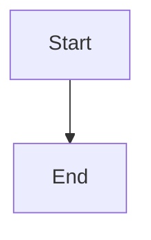
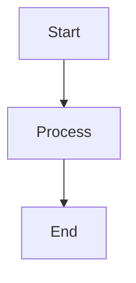

# Verifying Mermaid Diagrams on GitHub Pages
{: .no_toc }

This guide provides visual examples and step-by-step instructions for verifying that mermaid diagrams are rendering correctly on the GitHub Pages deployment.
{: .fs-6 .fw-300 }

---

## Table of Contents
{: .no_toc .text-delta }

1. TOC
{:toc}

---

## Quick Verification Checklist

Use this checklist when verifying mermaid diagram rendering:

- [ ] Visit the site at [https://maugx3.github.io/ai-tools/](https://maugx3.github.io/ai-tools/)
- [ ] Navigate to a page with mermaid diagrams
- [ ] Verify diagrams appear as graphics (not code blocks)
- [ ] Check that diagrams are fully visible
- [ ] Verify text is readable
- [ ] Confirm arrows and connections are visible
- [ ] Open browser console (F12) and check for errors
- [ ] Verify `window.mermaid` is defined
- [ ] Test on multiple browsers (Chrome, Firefox, Safari)

---

## Pages with Mermaid Diagrams

### 1. Information Sharing Workflow (5 diagrams)

**URL**: `/docs/guides/information-sharing-workflow`

This page contains the most comprehensive mermaid diagrams showing:
- Complete information flow diagram (largest, most complex)
- Component roles and relationships
- Sequential layering pattern
- Task-based workflow
- Knowledge capture workflow

**What to check**:
- Large flowchart at the top renders completely
- All nodes and connections are visible
- Text in nodes is readable
- Colors and styling match the defined classes

### 2. Memory Bank Instructions (6 diagrams each)

**URLs**: 
- `/instructions/memory-bank`
- Also in `.github/instructions/memory-bank.instructions.md` (if rendered)

Diagrams show:
- Memory Bank structure hierarchy
- Plan mode workflow
- Act mode workflow
- Task management flow
- Documentation update process
- Knowledge capture

**What to check**:
- All 6 diagrams render properly
- Hierarchical structure is clear
- Decision nodes (diamonds) are visible
- Flow arrows point correctly

### 3. LLM Information Flow (1 diagram)

**URL**: `/docs/explain/llm-information-flow`

Architecture diagram showing system components and data flow.

**What to check**:
- Diagram renders as expected
- Component relationships are clear
- Labels are readable

---

## Visual Verification Guide

### What Correct Rendering Looks Like

When mermaid diagrams are rendering correctly, you should see:

1. **SVG Graphics**: Diagrams appear as scalable vector graphics, not as fenced code blocks
2. **Nodes**: Boxes, circles, or other shapes containing text
3. **Connections**: Arrows connecting nodes
4. **Text**: Clear, readable labels on nodes and connections
5. **Colors**: Styled nodes based on the diagram definition
6. **Layout**: Proper spacing and alignment

### Common Issues to Watch For

#### Issue 1: Raw Code Blocks

**Problem**: You see this:
```

```

**Instead of**: A rendered flowchart diagram

**Solution**: 
- Check that `_includes/head_custom.html` is present
- Verify mermaid library is loading (check browser Network tab)
- Check browser console for JavaScript errors

#### Issue 2: Partially Rendered Diagrams

**Problem**: Diagram appears but is cut off or nodes overlap

**Solution**:
- Try zooming out in browser
- Check viewport settings
- Verify CSS isn't conflicting with mermaid styles

#### Issue 3: Blank Space Where Diagram Should Be

**Problem**: You see empty space but no diagram

**Solution**:
- Check browser console for errors
- Verify CDN (jsdelivr.net) is accessible
- Check that mermaid syntax in markdown is correct

---

## Browser Developer Tools Verification

### Step 1: Open Developer Console

- **Chrome/Edge**: Press `F12` or `Ctrl+Shift+I` (Windows) / `Cmd+Option+I` (Mac)
- **Firefox**: Press `F12` or `Ctrl+Shift+I` (Windows) / `Cmd+Option+I` (Mac)
- **Safari**: Enable Developer menu in Preferences, then press `Cmd+Option+I`

### Step 2: Check for Mermaid Library

In the Console tab, type:

```javascript
window.mermaid
```

**Expected result**: Should return an object with mermaid methods and properties

**If undefined**: Mermaid library is not loading

### Step 3: Check for SVG Elements

In the Console tab, type:

```javascript
document.querySelectorAll('svg.mermaid, .mermaid svg').length
```

**Expected result**: Should return the number of mermaid diagrams on the page (e.g., 5 for information-sharing-workflow)

**If 0**: Diagrams are not rendering

### Step 4: Check Network Tab

1. Open the Network tab
2. Refresh the page
3. Filter by "mermaid" or look for requests to "jsdelivr.net"
4. Verify mermaid library loads successfully (Status: 200)

### Step 5: Check for Errors

In the Console tab, look for any red error messages related to:
- mermaid
- Module loading
- SVG rendering
- JavaScript syntax errors

---

## Automated Testing

### Running Playwright Tests

The repository includes automated tests in `tests/mermaid.spec.ts`.

**To run tests locally**:

```bash
# Install dependencies (first time only)
npm install
npx playwright install --with-deps chromium

# Run mermaid tests
npm test -- tests/mermaid.spec.ts

# Run all tests
npm test
```

**Test coverage**:
- ✅ Diagrams render on information-sharing-workflow page
- ✅ Diagrams render on memory-bank instructions page
- ✅ Diagrams render on llm-information-flow page
- ✅ Diagrams have proper styling and dimensions
- ✅ Mermaid library is loaded globally
- ✅ No unrendered code blocks remain

### GitHub Actions Integration

Tests run automatically after each deployment:

1. Code is pushed to `main` branch
2. Jekyll builds the site
3. Site deploys to GitHub Pages
4. Playwright tests execute
5. Results appear in Actions tab

**To view test results**:
1. Go to repository Actions tab
2. Click on the latest workflow run
3. Check the "test-pages" job
4. View test output and any failures

---

## Local Development Testing

### Building the Site Locally

**Prerequisites**:
- Ruby 3.x
- Bundler
- Jekyll

**Steps**:

```bash
# Install Jekyll dependencies
bundle install

# Build and serve site locally
bundle exec jekyll serve

# Site will be available at:
# http://localhost:4000/ai-tools/
```

### Local Verification

1. Navigate to a page with mermaid diagrams
2. Open browser dev tools
3. Verify diagrams render correctly
4. Check console for errors
5. Test navigation between pages

---

## Troubleshooting Guide

### Problem: Diagrams don't render at all

**Checklist**:
1. ✓ `_config.yml` has mermaid configuration
2. ✓ `_includes/head_custom.html` exists and contains mermaid initialization
3. ✓ Browser can access jsdelivr.net CDN
4. ✓ No JavaScript errors in console
5. ✓ Markdown syntax is correct (triple backticks + "mermaid")

**Solution**: Run verification script
```bash
./scripts/verify-mermaid-setup.sh
```

### Problem: Diagrams render but look wrong

**Check**:
- CSS conflicts with theme styles
- Zoom level in browser
- Mermaid syntax errors in diagram code
- Theme configuration

**Solution**: Verify diagram syntax using [Mermaid Live Editor](https://mermaid.live/)

### Problem: Tests fail but site looks correct

**Possible causes**:
- Site not accessible from test environment
- Timing issues (increase timeout)
- Selector changes in mermaid output
- Network connectivity

**Solution**: Check GitHub Actions logs for specific error messages

---

## Best Practices

### When Adding New Mermaid Diagrams

1. **Test syntax first**: Use [Mermaid Live Editor](https://mermaid.live/) to validate
2. **Keep diagrams simple**: Complex diagrams may have rendering issues
3. **Use proper fencing**: Triple backticks with "mermaid" language identifier
4. **Add whitespace**: Leave blank lines before and after code blocks
5. **Document purpose**: Add a heading or description above the diagram
6. **Test locally**: Build site and verify rendering before committing
7. **Run verification**: Use `./scripts/verify-mermaid-setup.sh`

### Example of Proper Syntax

```markdown
## Workflow Diagram

The following diagram shows the complete workflow:



This diagram illustrates...
```

---

## Resources

- [Mermaid Documentation](https://mermaid.js.org/)
- [Mermaid Live Editor](https://mermaid.live/) - Test diagrams before adding
- [Just the Docs Theme](https://just-the-docs.github.io/just-the-docs/)
- [GitHub Pages Documentation](https://docs.github.com/en/pages)
- [MERMAID_VERIFICATION.md](../../MERMAID_VERIFICATION.md) - Technical verification guide
- [Playwright Documentation](https://playwright.dev/)

---

## Quick Reference

### Verification Commands

```bash
# Run verification script
./scripts/verify-mermaid-setup.sh

# Build site locally
bundle exec jekyll serve

# Run tests
npm test -- tests/mermaid.spec.ts

# Count mermaid diagrams
grep -r "^\\`\\`\\`mermaid" --include="*.md" . | wc -l
```

### Key URLs to Test

1. Main workflow: `/docs/guides/information-sharing-workflow`
2. Memory Bank: `/instructions/memory-bank`
3. LLM Flow: `/docs/explain/llm-information-flow`
4. Home page: `/` (should load mermaid library)

### Browser Console Checks

```javascript
// Check mermaid is loaded
window.mermaid

// Count SVG diagrams
document.querySelectorAll('svg.mermaid, .mermaid svg').length

// Get first diagram dimensions
document.querySelector('svg.mermaid, .mermaid svg').getBoundingClientRect()
```

---

*Last Updated: 2025-11-20*
